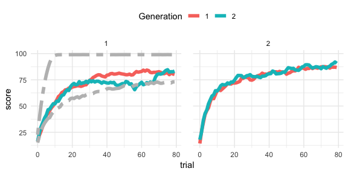
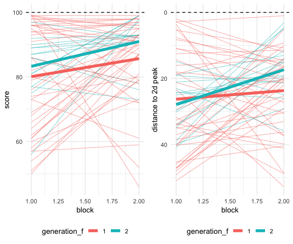
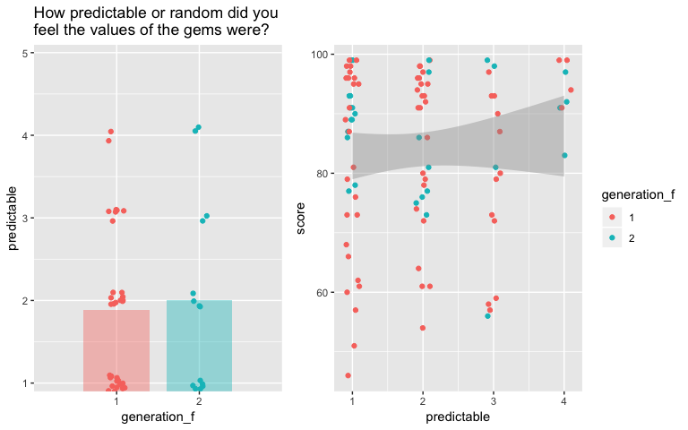
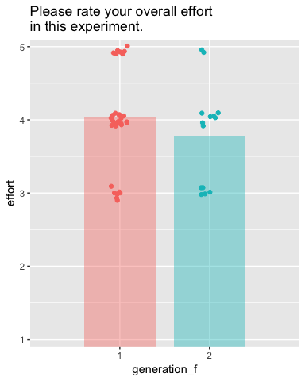
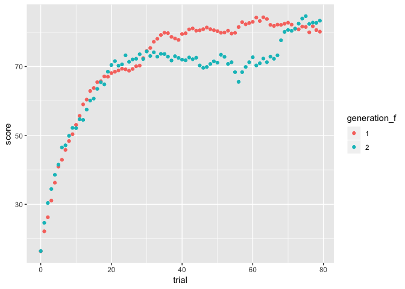
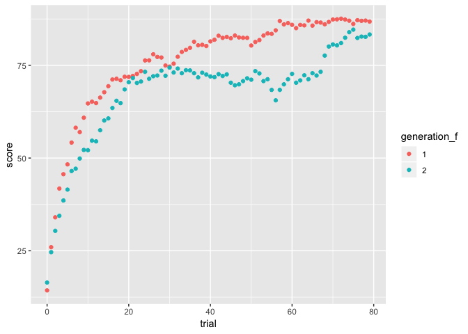

Inherited knowledge
================

# Introduction

## Research question

Can individuals pass on knowledge via language that enables future
generations to exceed previous generations?

# Methods

## Procedure

On each trial, participants see 6 gabor patches (“gems”) that vary in
orientation and bar width and they select the one they think is most
valuable.

Unbeknownst to the participants, the 6 gabors they see on each trial are
sampled from within a certain radius in stimulus space of their last
trial.

Participants are assigned to Generation 1 or Generation 2.

  - Generation 1 participants complete 2 blocks, then they type out
    instructions for the next generation, then they complete 2 more
    blocks.
  - Generation 2 participants read the instructions from Generation 1,
    then complete 4
blocks.

# Results

<!-- -->

<!-- -->

## Instructions

|              |                        |                    |                        |
| :----------- | :--------------------- | :----------------- | :--------------------- |
| **subj\_id** | **instructions\_gen1** | **subj\_id\_gen2** | **instructions\_gen2** |

## Survey

### Predictability

<!-- -->

### Effort

<!-- -->

## Hypotheses

### H1

*How does the performance of Generation 1 participants in blocks 1 and 2
compare to the performance of Generation 2 participants in blocks 1 and
2?*

Generation 2, having benefitted from the instructions left by Generation
1, will exceed the performance of Generation 2 in the first two blocks.

<!-- -->

### H2

*How does the performance of Generation 1 participants in block 2
compare to the performance of Generation 2 participants in block 1?*

Generation 2 will benefit from the instructions left by Generation 1 in
block 1 more than Generation 1 in block
2.

<!-- -->
