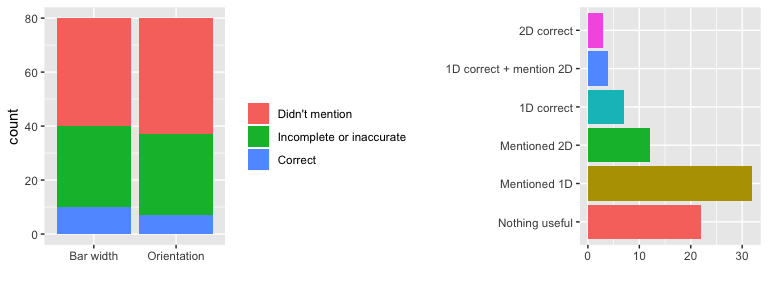
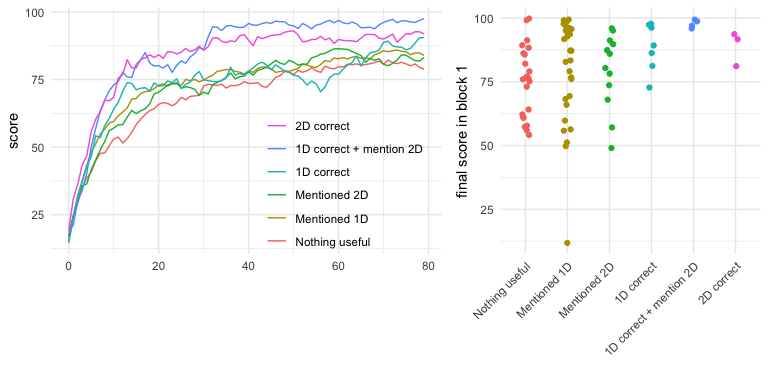

Inherited knowledge
================

# Introduction

## Research question

Can individuals pass on knowledge via language that enables future
generations to exceed previous generations?

# Methods

Participants learned to categorize visual stimuli on the basis of two
visual dimensions. The stimuli were sinusoidal gabor patches that varied
in orientation and spatial frequency. Participants were told to think of
each gabor patch as a “gem” and that their task was to find the most
valuable gems. The value of each gem was determined by its orientation
and spatial frequency.

Participants were assigned to the first or second generation of a
two-generation transmission chain. Generation 1 participants completed
the task naively, without receiving instructions about what makes some
gems more valuable. After one block of trials, these participants wrote
down a description of what makes some gems more valuable that would be
helpful to the next generation. Participants assigned to the second
generation inherited these instructions, and read them before completing
their trials. After one block of trials, participants in generation 2
wrote down a description of what makes some gems more valuable, and
completed a second block of trials.

## Procedure

On each trial, participants are presented 6 gabor patches (“gems”) that
vary in orientation and spatial frequency, and they select one expected
to be the most valuable. After selecting a gem, they receive feedback
about its value relative to the value of the gem they selected on the
previous trial. For example, a participant might learn that the gem they
selected was worth +3 more than their previous one. They are also shown
their new total score, a number between 0 and 100.

# Results

## Scores

(ref:scores) Score over trials and blocks. Gray lines show simulated
performance of optimal and random walk
agents.

## Reaction times

<!-- -->

## Instructions

<!-- -->

<!-- -->

## The effects of inherited instructions

### Are instructions better than no instructions?

Participants in Generation 2 will benefit from accurate instructions in
block 1 relative to naive participants in Generation 1, block
1.

<!-- -->

### Are instructions better than 1 block of training?

Participants in Generation 2 will benefit from accurate instructions
relative to how participants in Generation 1 perform *after* generating
the
instructions.

<!-- -->
