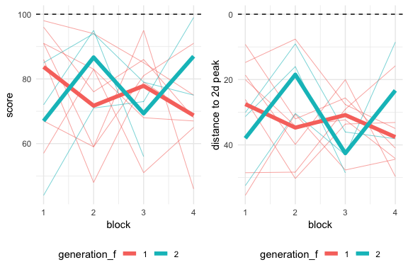
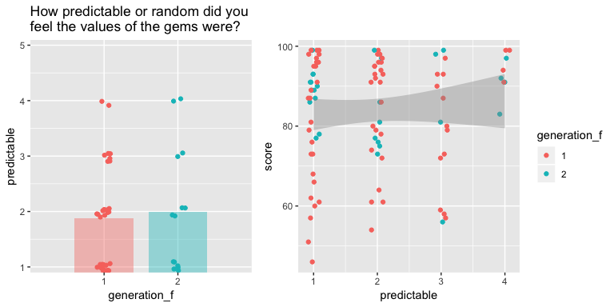

Supplementary materials
================

# Results

## V1.1

<!-- -->

<!-- -->

## V1.2

| subj\_id | instructions\_gen1                                                                                                                                                                                                                                                                                                                                                                                                                           | subj\_id\_gen2 | instructions\_gen2                                                                                                                                                                                                                                                                                                                                                                                                                                                                                                                                                                                                                                                                                                                                                                                                                                                                                                                                                                                                                                       |
| :------- | :------------------------------------------------------------------------------------------------------------------------------------------------------------------------------------------------------------------------------------------------------------------------------------------------------------------------------------------------------------------------------------------------------------------------------------------- | :------------- | :------------------------------------------------------------------------------------------------------------------------------------------------------------------------------------------------------------------------------------------------------------------------------------------------------------------------------------------------------------------------------------------------------------------------------------------------------------------------------------------------------------------------------------------------------------------------------------------------------------------------------------------------------------------------------------------------------------------------------------------------------------------------------------------------------------------------------------------------------------------------------------------------------------------------------------------------------------------------------------------------------------------------------------------------------- |
| GEMS111  | I thought that more lines meant more valuable I also found there was a pattern where I should select a gem with more lines and more rotated clockwise than the gem I had selected previously, however, this theory was not always correct and frustrated me.                                                                                                                                                                                 | GEMS125        | The more stripes are on the gem, the more valuable it is. The more it is tilted clockwise, the more it is valuable. Your score is not affected when you choose the same gem.                                                                                                                                                                                                                                                                                                                                                                                                                                                                                                                                                                                                                                                                                                                                                                                                                                                                             |
| GEMS112  | The more similar a gem looks to the one chosen before, the more likely it is to be more valuable. Gems with thicker stripes and gems with too thin of stripes seemed to be less valuable. Gems also seemed more valuable with not too many, but also not too little stripes.                                                                                                                                                                 | GEMS126        | the more similarity to the previously chosen one contributes to a higher value. also, the strips should not be too thick or too thin when you first choose it or when you need to choose between similar ones.                                                                                                                                                                                                                                                                                                                                                                                                                                                                                                                                                                                                                                                                                                                                                                                                                                           |
| GEMS113  | Even though I don’t think it necessarily worked, I tried to choose the gem that looked like it ‘did not fit’ or the one that looked the most different. However, I looked for other patterns and it seemed to be random.                                                                                                                                                                                                                     | GEMS127        | I thought that what was most important was the amount of line visible in the circle and how fuzzy it was.                                                                                                                                                                                                                                                                                                                                                                                                                                                                                                                                                                                                                                                                                                                                                                                                                                                                                                                                                |
| GEMS114  | the density of lines on the gems may be related to the value.More lines may indicate more value. Besides, the light lines may imply more value than bold lines according to my attempt. There may also exists relationship between the value of the gems and the gardient level of lines on the gems, but I do not figure it out clearly.                                                                                                    | GEMS128        | The more lines there are on the gem, the more points one will score especially towards the beginning. However it seems later towards the game, the number of lines didn’t seem to matter as much. Later towards the game, the angle at which the lines appeared on the gem seemed to matter as well.                                                                                                                                                                                                                                                                                                                                                                                                                                                                                                                                                                                                                                                                                                                                                     |
| GEMS115  | I believe that the gems with the most shine to them are the most valuable. you can tell based off of how much black to white there is. with more lines to it, there will be more value.                                                                                                                                                                                                                                                      | GEMS129        | Be very observant to how many lines and amount of black space there are between the white lines. Generally, the gems with less space, and more white bars ar more valuable. Also, the gems that have rotation of bars closer to facing horizontal, specifically anglig west to east will be more valuable.                                                                                                                                                                                                                                                                                                                                                                                                                                                                                                                                                                                                                                                                                                                                               |
| GEMS116  | I do not think there is much of a difference in the gems. I compared the darkness of the black, the thickness of the lines, the angles in which the lines were going, the shifts of movement in the lines where in such as if the left end starts with a black or white striped line. Nothing helps, so good luck trying to score the most points.                                                                                           | GEMS130        | The person before me mentioned that they tested the gems for bar width, number of bars, thickness, angle of the bars, etc. As a result, I trusted their advice and resisted the urge to test the gems for the most basic factors. What I found what that if you selected a gem for it’s unique characteristics, for example having more lines or finer detail, then the next set of gems would all display those traits. In other words, the new set of gems looks a lot more like the gem you choose than the previous set of gems. So, pay attention to every detail before choosing the next gem, and then pick the more valuable gem and note the differences. I found success in paying attention to whether it looked like it was black lines on a white background or white lines on a black background, and got points by selecting the gem that had a, more bars, and b, looked like white bars on a black background. Don’t let this narrow your mind, though, but try it and see if it works. Otherwise, go to the strategy I mentioned above |
| GEMS117  | The gems that have white borders on the right and left sides of the circle are more likely to be a postive value than circles that have black borders.                                                                                                                                                                                                                                                                                       | GEMS131        | Turn the lines on the gem clockwise after you choose a gem. Generally, more lines and further clockwise yields higher and positive values. Choose similar a gem that is similar to the last one you picked at around 90 to 95 points. The gem will have many lines on it and be approximately horizontal.                                                                                                                                                                                                                                                                                                                                                                                                                                                                                                                                                                                                                                                                                                                                                |
| GEMS118  | It seemed that at the start the gems with lines that were more horizontal than verticle were more valuable. Also the gems with more lines seemed to be more valuable. However, it also seemed that as I selected they same style of gems mulitple times in a row, they would lose their value and sometimes even become negative so I recommend switching styles of gems if this happens.                                                    | GEMS132        | I think the one has more part of white is more valuable.You probably can’t choose the same three times.                                                                                                                                                                                                                                                                                                                                                                                                                                                                                                                                                                                                                                                                                                                                                                                                                                                                                                                                                  |
| GEMS119  | Gems that are more valuable have a greater frequency of white and black lines and those lines are thinner than the lines on less valuable gems.A gem also increases in value the closer its lines get to being about 15 degrees counterclockwise of horizontal.                                                                                                                                                                              | GEMS133        | stared at them, comparing the thickness of lines and choose the less thicker one. and the space between them, as well as the angle of these line.                                                                                                                                                                                                                                                                                                                                                                                                                                                                                                                                                                                                                                                                                                                                                                                                                                                                                                        |
| GEMS120  | Gems are more valuable as the lines become more abundant and ‘zoomed out’ in the circle. Also, the circle of lines should be rotating clockwise each time to be more valuable.                                                                                                                                                                                                                                                               | GEMS134        | As you continue throughout the collection process, choosing the gems with more and more lines givs you points as well as the gems turning clockwise. He gems will increase in the number of lines and once the gems have turned half way going clockwise, they turn counterclockwise back to their original position, I believe.                                                                                                                                                                                                                                                                                                                                                                                                                                                                                                                                                                                                                                                                                                                         |
| GEMS121  | The thinner the lines on the gem are, the more valuable it is. Also, the more horizontal those lines are, the more valuable it is.                                                                                                                                                                                                                                                                                                           | GEMS135        | pay attention to if the lines are horizontal or not and if there is more dark if there is more dark dont select it. Later try to minimize losses by picking the gems closest to the one below because it is hard to gain at that point                                                                                                                                                                                                                                                                                                                                                                                                                                                                                                                                                                                                                                                                                                                                                                                                                   |
| GEMS122  | The value of gems depends on the orientation of the lines on the gems. You want it to be as close to 180 degrees or horizontal as possible                                                                                                                                                                                                                                                                                                   | GEMS136        | The clearer the image and the more horizontal the lines are on it, the better the gem. Be sure to know that placement does not matter.                                                                                                                                                                                                                                                                                                                                                                                                                                                                                                                                                                                                                                                                                                                                                                                                                                                                                                                   |
| GEMS123  | Pick gems that look similar to the one you previously picked, but less blurry along the stripes. The gem should be slanted the same way as the one you previously picked.                                                                                                                                                                                                                                                                    | GEMS141        | I have no idea. Maybe the slant of the gem or pattern of colors. If a black strip is at the edge of the circle or a white strip.                                                                                                                                                                                                                                                                                                                                                                                                                                                                                                                                                                                                                                                                                                                                                                                                                                                                                                                         |
| GEMS124  | The gems that are the most valuable I believe to be the ones with the most lines at the greatest angle. These are also the most visually clear, and less blurry.                                                                                                                                                                                                                                                                             | GEMS142        | I believe the ones that are the most valuable are the ones that have the sharpest edges between the white and black strips as well as at a larger angle compared with the rest.                                                                                                                                                                                                                                                                                                                                                                                                                                                                                                                                                                                                                                                                                                                                                                                                                                                                          |
| GEMS137  | I think gems with a higher number of lines are more valuable than gems with lower numbers. I’m not completely sure what the direction of the lines has to do with the value, but I think choosing ones close to the previously selected valuable gem will end up being the next most valuable gem.                                                                                                                                           | GEMS143        | There seems to be a number of lines which yields points more often than not. I think this was around 8. I did notice that the first gem is worth 22 points, and that one only has five lines. I couldn’t find a pattern with orientation or color. I had thought at first that the farther clockwise they go, the more worth they would have, but this proved false.                                                                                                                                                                                                                                                                                                                                                                                                                                                                                                                                                                                                                                                                                     |
| GEMS138  | I found that picking gems most similar to the gem presented got me the most points. However, when I picked the gem that was identical to the gem presented, a majority of the time I got zero points. I also tried to see if the number of lines and thickness of lines make the gems more valuable. I found that more lines usually means the gem is more valuable. I did not find anything important regarding the thickness of the lines. | GEMS148        | The value of each gem seems to correlate with how it compares to the previous gem. For example, a positive value was given to a majority of gems that had lines slightly more horizontal than the last. Selecting a gem whose lines were more horizontal than the last has something to do with the value. I didnt find any correlations between number of line and thickness, however as the linqes got more and more horizontal the gems had a higher number of lines.                                                                                                                                                                                                                                                                                                                                                                                                                                                                                                                                                                                 |
| GEMS144  | the gems that have more white lines and less black space are more valuable than those that don’t. usually, the ones in the middle are worth more points than those on the outside, however, this is questionable at times.                                                                                                                                                                                                                   | GEMS149        | The more horizontal the lines are, the more valuable the gems are. Closer to the center, the gems are more valuable.                                                                                                                                                                                                                                                                                                                                                                                                                                                                                                                                                                                                                                                                                                                                                                                                                                                                                                                                     |
| GEMS145  | I think what makes more gems valuable than others is the placement of the gems and where they are located. I noticed that when clicking on the same gem in the same place multiple times, the values changed, so you have to explore other gems and move around.                                                                                                                                                                             | GEMS150        | I think that either the number of black diagonal lines has to do something with the value of the gems. The more black lines, the more valuable. When all gems had the same number of black lines, then I either guessed the left most gem, or I looked for a gem that was an outlier in angle compared to the rest of the gem.                                                                                                                                                                                                                                                                                                                                                                                                                                                                                                                                                                                                                                                                                                                           |
| GEMS146  | There really wasn’t anything that stood out to me. To be honest, a lot of times I didn’t even notice a difference.                                                                                                                                                                                                                                                                                                                           | GEMS151        | There is no pattern regarding which gems are most valuable. Sometimes gems with more stripes are more valuable and sometimes gems with less stripes are more valuable.                                                                                                                                                                                                                                                                                                                                                                                                                                                                                                                                                                                                                                                                                                                                                                                                                                                                                   |
| GEMS147  | I think that the gems with the more black, i.e. black background with white stripes were more valuable. Also, gems with strips facing the one pm position.                                                                                                                                                                                                                                                                                   | GEMS166        | i have benn trying to pick the ones with the most stripes on them and that point in a different direction than most of the other gems                                                                                                                                                                                                                                                                                                                                                                                                                                                                                                                                                                                                                                                                                                                                                                                                                                                                                                                    |
| GEMS154  | Generally the smaller the lines on the gem, the better. There needs to be about 10 white and black lines on the gem for it to be most valuable.                                                                                                                                                                                                                                                                                              | GEMS167        | The spacing between the stripes is something to pay attention to. As the spacing gets smaller, look for how straight the stripes are and that will help with improving the value of the gems. There seems to be no pattern observable to which color stripe should go first and as the thickness gets smaller it becomes very less clear which gems are more valuable. There does seem to be a pattern to look for that has to do with the angle that the stripes are in as you progress but I couldn’t figure it out.                                                                                                                                                                                                                                                                                                                                                                                                                                                                                                                                   |
| GEMS155  | the larger the number that appears on each gem, the more valuable the are. for instance, if a plus 16 appears on a gem, this indicates that the gem is of great value. whereas a minus 16 would diminish the value of the gem.                                                                                                                                                                                                               | GEMS168        | pay attention to the numeber of lines on the gems and the direction of the whole circle. at first maybe the lines of gems should increase more and more, choose the gems with more lines, it maybe more valuable. about the directon, don’t make the cirvle change the angle more than 90                                                                                                                                                                                                                                                                                                                                                                                                                                                                                                                                                                                                                                                                                                                                                                |
| GEMS156  | Select the gem with the least ammout of black lines in it. Also slect the gem that is the most off center.                                                                                                                                                                                                                                                                                                                                   | GEMS169        | I believe that when a gem is more off kilter from the center, meaning that the lines on it are diagonal, the more valuable the gem is.                                                                                                                                                                                                                                                                                                                                                                                                                                                                                                                                                                                                                                                                                                                                                                                                                                                                                                                   |
| GEMS157  | Try to look for the gems that has the same or close to the same amount of strips. Also it is helpful to look for gems that have a white,black,white pattern. I though that were the most valuable.                                                                                                                                                                                                                                           | GEMS170        | the order of white black white is more valuable and the gems should be parallel to each other so that it is more valuable than others.                                                                                                                                                                                                                                                                                                                                                                                                                                                                                                                                                                                                                                                                                                                                                                                                                                                                                                                   |
| GEMS158  | I believe you have to find pitures with more line than the previous one, with the the lines most outside having different color, also, and find the more inclined ones                                                                                                                                                                                                                                                                       | GEMS171        | actually, i had no idea. maybe find the different one in all given choices.when i try to find the one had most number of lines, it turned out to be run. then i tried to find the one had lines more than before, it turned out to be wrong. so, i totally had no idea to find the most vauable gem.                                                                                                                                                                                                                                                                                                                                                                                                                                                                                                                                                                                                                                                                                                                                                     |
| GEMS159  | When you are picking a gem , you should start by picking one of the middle gems. The next gem you pick is more valuable is the 1st gem you picked that’s the left or right side of the 1st gem picked. Pick another gem that’s in the middle of the group of gems. Then you pick a gem that is left or right of one of the middle gems.                                                                                                      | GEMS172        | try to choose the gems in the middle when you start. even though the location of gems doesn’t affect their value, it’s helpful to start from middle.                                                                                                                                                                                                                                                                                                                                                                                                                                                                                                                                                                                                                                                                                                                                                                                                                                                                                                     |
| GEMS160  | Sometimes I felt like I needed to pick the most different one, but sometimes I felt like by doing that, I’d get a negative number. Sometimes I felt Like I had to pick the ones with thinner bars                                                                                                                                                                                                                                            | GEMS173        | For the first group I thought the most valuable was the gem with the most black lines. For the next group I orginally thought it was whichever gem was tilted the most but then started to think it was the gem with the most white lines.                                                                                                                                                                                                                                                                                                                                                                                                                                                                                                                                                                                                                                                                                                                                                                                                               |
| GEMS161  | The gems with the skiniest and most lines are the most valuable. Often times they have more vertical lines and are more appealing to the eye.                                                                                                                                                                                                                                                                                                | GEMS174        | When you begin the gems with the most lines hold the greatest value. If you get one incorrect, the value of the gems changes and the ones who hold the most value have less lines than the previously chosen gem.                                                                                                                                                                                                                                                                                                                                                                                                                                                                                                                                                                                                                                                                                                                                                                                                                                        |
| GEMS162  | the way i was able to decide which gems were more valuable was by the way they look compared to the others. i first started out seeing which ones would stand out from the rest of the gems. but, once i saw that the number of lines varied i decided to look and see which had more lnes in respective to the rest. lastly, i also looked at the colors. the ones with more vivid colors i would pick over tye more blurry colored ones.   | GEMS175        | I found that the best gems were the ones with the most clear lines. Also, the gems worth the most points seemed to be tilted at about a 45 degree angle, going upwards as the gem went left to right.                                                                                                                                                                                                                                                                                                                                                                                                                                                                                                                                                                                                                                                                                                                                                                                                                                                    |
| GEMS163  | I think that the gems are more valuable on the left side. Also I think that gems that do not look like the previous gem that was selected is more valuable.                                                                                                                                                                                                                                                                                  | GEMS176        | The gems are all basically impossible to differentiate. Good luck, I hope you can do better than I can.                                                                                                                                                                                                                                                                                                                                                                                                                                                                                                                                                                                                                                                                                                                                                                                                                                                                                                                                                  |
| GEMS164  | To determine the value of a gem, use the thickness and spacing of the lines. Gems that are more valuable will have more black lines which will be thicker than the white lines. The more valuable the gem is, the more defined the lines will be as well, i.e. not blurry.                                                                                                                                                                   | NA             | NA                                                                                                                                                                                                                                                                                                                                                                                                                                                                                                                                                                                                                                                                                                                                                                                                                                                                                                                                                                                                                                                       |
| GEMS165  | I never found a pattern that consistently gave me valuable gems. However, I found that clicking on gems in order from left to right, or right to left, gave me several harmful gems.                                                                                                                                                                                                                                                         | NA             | NA                                                                                                                                                                                                                                                                                                                                                                                                                                                                                                                                                                                                                                                                                                                                                                                                                                                                                                                                                                                                                                                       |

## V1.3

### Instructions

| subj\_id | instructions\_gen1                                                                                                                                                                                                                                                                                                                                                                                                                              | subj\_id\_gen2 | instructions\_gen2                                                                                                                                                                                                                                                                                                                                                                                                                                                                                                                                                                                                                                                             |
| :------- | :---------------------------------------------------------------------------------------------------------------------------------------------------------------------------------------------------------------------------------------------------------------------------------------------------------------------------------------------------------------------------------------------------------------------------------------------- | :------------- | :----------------------------------------------------------------------------------------------------------------------------------------------------------------------------------------------------------------------------------------------------------------------------------------------------------------------------------------------------------------------------------------------------------------------------------------------------------------------------------------------------------------------------------------------------------------------------------------------------------------------------------------------------------------------------- |
| GEMS177  | The patterned seemed to be that gems with more lines were more valuable than gems with less lines. Additionally, thicker lines appear to be a property of more valuable gems as well.                                                                                                                                                                                                                                                           | GEMS193        | The gems that seem to be worth more are either ones with more lines on them or ones with thicker lines. Check all of the gems in the set and if there is one that seems to have a lot more lines or a much thicker lines, then choose it. Use the value of the gems you pick to decide whether a similar gem is a good choice.                                                                                                                                                                                                                                                                                                                                                 |
| GEMS178  | Some gems are more valuable based on there points and also they need to be similar to the gems you previously picked.                                                                                                                                                                                                                                                                                                                           | GEMS194        | I think the gems with more value have more lines on them. So the gems with lines that are far apart and thicker will have less value then the ones with thinner and more lines on them.                                                                                                                                                                                                                                                                                                                                                                                                                                                                                        |
| GEMS179  | Stick with the same few gems and keep clicking them I think it is better to do that then go completely random.                                                                                                                                                                                                                                                                                                                                  | GEMS195        | instead of just trying on random gem i think it is more helpful to stick to one type of gem and try to find out the pattern of the score change                                                                                                                                                                                                                                                                                                                                                                                                                                                                                                                                |
| GEMS180  | The more lines they had the more valuable the gem was. Look at the pattern of the gem and see how many lines that it has.                                                                                                                                                                                                                                                                                                                       | GEMS196        | I could not find a pattern at all. If I kept getting negative points, the gems with less lines got me points back faster.                                                                                                                                                                                                                                                                                                                                                                                                                                                                                                                                                      |
| GEMS181  | the more fine the lines are on the gems up to a certain point, the more valuable it is. The more horizontal the lines are as well make it more valuable.                                                                                                                                                                                                                                                                                        | GEMS197        | The more slanted the line is, the more valuable the germ is. The more lines the germ has, the more valuable the germ is.                                                                                                                                                                                                                                                                                                                                                                                                                                                                                                                                                       |
| GEMS182  | For certain gems, the one’s that have the most lines are more valuable than the others generally. It’s very hard to tell the value of gems after so many lines.                                                                                                                                                                                                                                                                                 | GEMS198        | a combination of strategies should be used. at first it may be related to the number of lines in each gem. however, as you score more, it may be relate to the angle of the line to the horizon.                                                                                                                                                                                                                                                                                                                                                                                                                                                                               |
| GEMS183  | It took me a while to find a pattern, but what I found is that a gem becomes more valuable when it is rotated clockwise. To clairfy, when the bars more and more to the right. Howeve, I found that when it got to the center, it went the other way, so counterclockwise.                                                                                                                                                                      | GEMS199        | I noticed that the gems I selected were rotated in a certain way. When you first start out, the lines on the gems will be going up and down. From there, you’ll want to pick the gem that is turned more clockwise. Gem after gem, you’ll want to pick which one is turned the most clockwise. When that method seems to not work anymore, choose the gems that are turned more counterclockwise and go from there.                                                                                                                                                                                                                                                            |
| GEMS184  | Honestly, I did not really catch onto what makes certain gems worth more than the other gems. Some thoughts I had was maybe the strips of the previous gem selected had some correlation to the worth of the next gem. I also thought maybe the overall position if it was 1st,2nd,3rd,etc. might have had something to do with it, but none of these theories I had was backed with any evidence from the game.                                | GEMS200        | I dont really know what makes certain gems more valuable than others. I just ended up picking random gems each time trying to find correlations. Over time it seemed like those with very small lines and very large, fat lines tended to result in negative values. So I tried picking the gems with medium line thickness to see if that worked which it did some of the time. I also tried to see if there was a pattern in what order you picked them and was unable to come up with concrete solution that garauntees a positive value. In the end it seemed to be just a random crap shoot on which gems were more valuable than others as they all look fairly similar. |
| GEMS185  | Gems with more lines are more valuable to start. You want to go for tilted lines with a few lines thicker than the others. But at the end it’s totally random just to get in your head.                                                                                                                                                                                                                                                         | GEMS201        | Too many lines thin or thick never seemed to get a high score, other than that I could never figure out which gem was the most valuable. The previous instructions had been to look for the thicker lines with more stripes, but that did not seem to benefit.                                                                                                                                                                                                                                                                                                                                                                                                                 |
| GEMS186  | i don’t think there are any tips. if there are more bricks appear in the screen just choose the one that is different. with more and more line in the one circle, choose the one that is similiar to other                                                                                                                                                                                                                                      | GEMS202        | the only small pattern i found was picking out the gem that didn’t match the others. i didn’t think your previous gem mattered.                                                                                                                                                                                                                                                                                                                                                                                                                                                                                                                                                |
| GEMS187  | The valued gems have thin stipes on them, but once the stripes are too thin the value decreases. The direction of stripes does not matter.                                                                                                                                                                                                                                                                                                      | GEMS203        | It seemed like the onrs that were more valuable alternated based on the thickness of the lines in the gems                                                                                                                                                                                                                                                                                                                                                                                                                                                                                                                                                                     |
| GEMS188  | Look for the gems that have the biggest boarders on the outside, where the lines are the fattest. These are the more valuable gems.                                                                                                                                                                                                                                                                                                             | GEMS204        | the last person wrote the more valuable gems are the fattest and the borders are wide but it really depends. after several time i chose the thicker black line, it doesn’t work anymore.                                                                                                                                                                                                                                                                                                                                                                                                                                                                                       |
| GEMS189  | I think that the size of the stripes, the thickness of the black and white stripes, and how zoomed in or out the gem is are determinants of what makes some gems more valuable than others. Also, at the end, I started to notice how if I collected a gem with a white line on the top, another valuable gem would be black on the top. Also, I realized that if a gem looks like the one you previously collect, it is mostly worth 0 points. | GEMS205        | You will think that the gems all look the same. As you progress, the lines become more focused and thinner. Keep picking the one with the most lines. One that has less lines that the previous one will give you negative points. One exactly the same will give you zero points. Once the lines are pretty small, start to look at the angle of them. An angle that isn’t the same but not totally different is a good one to pick.                                                                                                                                                                                                                                          |
| GEMS190  | The gems that have blurry lines are less valuable. Gems with thinner lines are more valuable. Gems whose lines are horizontal are less valuable. Finding gems that look like the previous gem will either get you zero points or positive points.                                                                                                                                                                                               | GEMS206        | Try to pick the gem that is most similar to the last gem you picked. Also, choose the gem that that has a medium sized line and the one with the most vertical lines.                                                                                                                                                                                                                                                                                                                                                                                                                                                                                                          |
| GEMS191  | The thiner the lines, the more precious the gems. Also, I belive that the closer the gem is to having horizontal lines, it is more precious.                                                                                                                                                                                                                                                                                                    | GEMS207        | The thinner the stripes, the more valuable the gem. Not sure if the direction of the stripes is important, I was thinking the more horizontal the more valuable.                                                                                                                                                                                                                                                                                                                                                                                                                                                                                                               |
| GEMS192  | When choosing the most valuble gems, choose the ones that are tilted at about 10 degrees and with lines that are almost horizontal. You should not choose lines are are tilted at negative 10 degrees or 350 degrees. The lines must also be moderate in width.                                                                                                                                                                                 | GEMS208        | I think the gems tilted at 10 degrees are most valuable. I also think that the gems with the biggest lines out of the 5 on the screen are the least valuable. Do not click the same gem more than 3 times in a row.                                                                                                                                                                                                                                                                                                                                                                                                                                                            |
| GEMS209  | i thought that if they looked similiar it made them more valuable but then my points started decreasing so i am really not sure what makes some gems more valuable than others                                                                                                                                                                                                                                                                  | NA             | NA                                                                                                                                                                                                                                                                                                                                                                                                                                                                                                                                                                                                                                                                             |
| GEMS210  | the lines form about 45 degree with the horizontal line. Should not be too dense. Black and white lines should be about the same width.                                                                                                                                                                                                                                                                                                         | NA             | NA                                                                                                                                                                                                                                                                                                                                                                                                                                                                                                                                                                                                                                                                             |
| GEMS211  | The gems are more vauluable when they are bolder and have more lines.They have more focued in their appearance then the one before it meaning it is usually more valuable then the last one you saw.                                                                                                                                                                                                                                            | NA             | NA                                                                                                                                                                                                                                                                                                                                                                                                                                                                                                                                                                                                                                                                             |
| GEMS212  | I think that if one of the other gems, in the relation to one’s prvious pick, has more lines, then it is most likely more valuable. Also, if the colors of the new jem coincide with the last stripe color on the old jem, it will also be worth more.                                                                                                                                                                                          | NA             | NA                                                                                                                                                                                                                                                                                                                                                                                                                                                                                                                                                                                                                                                                             |
| GEMS213  | As you go farther on in the game, the gems start to contain more lines, so choose a gem that has more lines than the first one. They also begin to change angles as the lines aren’t level. When you’re picking gems, alternate the angles of the lines with each new gem.                                                                                                                                                                      | NA             | NA                                                                                                                                                                                                                                                                                                                                                                                                                                                                                                                                                                                                                                                                             |
| GEMS214  | What I think makes some gems more valuable is by how many lines there are. The more lines there are, the more valuable it is but then it changes because the gems with less lines is more valuable then the one with more lines.                                                                                                                                                                                                                | NA             | NA                                                                                                                                                                                                                                                                                                                                                                                                                                                                                                                                                                                                                                                                             |
| GEMS215  | I found that I got the most points when I selected a gem with each of its lines entirely showing. I also got zero points for an 8 stiped Gem…but I don’t think that is much to work off of. Also I feel like when the lines of the gems are more blurry they are worth less.                                                                                                                                                                    | NA             | NA                                                                                                                                                                                                                                                                                                                                                                                                                                                                                                                                                                                                                                                                             |
| GEMS216  | In order to be successful in this experiement you need to not get frusterated and allow yourself to experiment new options even if points may be lost. I looked for gems that were similar to one another, but I don’t think I uncovered the pattern.                                                                                                                                                                                           | NA             | NA                                                                                                                                                                                                                                                                                                                                                                                                                                                                                                                                                                                                                                                                             |
| GEMS217  | I really can’t tell what is happening all I just tried to pick the mopst similar gem when I got points and most different gem when I got negative points                                                                                                                                                                                                                                                                                        | NA             | NA                                                                                                                                                                                                                                                                                                                                                                                                                                                                                                                                                                                                                                                                             |
| GEMS218  | While looking for gems, there appears to be a trend between the number of lines and the tilt of the lines. You should prioritize the number of lines up until a point. However, when it comes to tilt, you want to prioritize the rotation until they become parallel horizontally. Once you are at parallel, the number of lines must be fine tuned in order to find the gem of the most value.                                                | NA             | NA                                                                                                                                                                                                                                                                                                                                                                                                                                                                                                                                                                                                                                                                             |
| GEMS219  | I think that the more titled they were from the starting postion and the more lines through the gem correlated to the more valuable gem                                                                                                                                                                                                                                                                                                         | NA             | NA                                                                                                                                                                                                                                                                                                                                                                                                                                                                                                                                                                                                                                                                             |
| GEMS220  | select gems that have less number of lines and and have a slope that increases going left to right. If the extremes of the pattern ends in white, or white with slight hint of black, they may be worth value                                                                                                                                                                                                                                   | NA             | NA                                                                                                                                                                                                                                                                                                                                                                                                                                                                                                                                                                                                                                                                             |
| GEMS221  | I might just be stupid but I couldn’t really find a set pattern. I thought it was the smaller lines meant they were more valuable but then they would have negative numbers some times, same with how crisp the lines were, or the angle they were tilted at.                                                                                                                                                                                   | NA             | NA                                                                                                                                                                                                                                                                                                                                                                                                                                                                                                                                                                                                                                                                             |
| GEMS222  | I’m not super positive but I think what makes certain gems more valuable than others is determined by where they land on the in the sequence. The pattern shifts every other gem and shifts one step to the right each time. Overall, I think that sequencing and left to right movement has something to do with how gems are arranged.                                                                                                        | NA             | NA                                                                                                                                                                                                                                                                                                                                                                                                                                                                                                                                                                                                                                                                             |
| GEMS223  | Consistency… how clear or defined they are, usually the clearer they were, the more value they had. The number of bands also made a difference in the value of the gem. Usually the number of bands meant a higher value                                                                                                                                                                                                                        | NA             | NA                                                                                                                                                                                                                                                                                                                                                                                                                                                                                                                                                                                                                                                                             |
| GEMS224  | the gems that are more valuable have more diagonal lines and don’t have too many lines in the gem but also don’t have too few lines so they are right in the middle.                                                                                                                                                                                                                                                                            | NA             | NA                                                                                                                                                                                                                                                                                                                                                                                                                                                                                                                                                                                                                                                                             |
| GEMS225  | Try the ones with thin lines and standing more vertical. Do not pick the same gem as you did the previous time. Try and find a pattern to the game.                                                                                                                                                                                                                                                                                             | NA             | NA                                                                                                                                                                                                                                                                                                                                                                                                                                                                                                                                                                                                                                                                             |
| GEMS226  | find the gem that is wider for each line. the lines for each valuable gems all go in the same directon. the line tend to be more and more condense as value increase, and the value of the next gem increase as the lines of the last gem go up a little bit.                                                                                                                                                                                   | NA             | NA                                                                                                                                                                                                                                                                                                                                                                                                                                                                                                                                                                                                                                                                             |
| GEMS227  | I do not kno how the points operate, but it appears that if you click ones with thicker lines, then the next set will also have thicker lines and vice versa with smaller lines.                                                                                                                                                                                                                                                                | NA             | NA                                                                                                                                                                                                                                                                                                                                                                                                                                                                                                                                                                                                                                                                             |
| GEMS228  | the amout of lines and how think the lines are and which way the are facing for example gems with more lines are more valuable                                                                                                                                                                                                                                                                                                                  | NA             | NA                                                                                                                                                                                                                                                                                                                                                                                                                                                                                                                                                                                                                                                                             |
| GEMS229  | Gem stones are more valuable when the stripes are closest to horizontal, or closer to horizontal than the last chosen gem.                                                                                                                                                                                                                                                                                                                      | NA             | NA                                                                                                                                                                                                                                                                                                                                                                                                                                                                                                                                                                                                                                                                             |
| GEMS230  | I think the ending has of the gems have a lot to do with the outcome of the score. I would also look at the boldness and the thickness of each line in comparison to the previous gem that you have chose.                                                                                                                                                                                                                                      | NA             | NA                                                                                                                                                                                                                                                                                                                                                                                                                                                                                                                                                                                                                                                                             |
| GEMS231  | Stay consistent with one, two, or three gems rather than randomly clicking on all of them. The gains usually outweight the losses. The value of the gems is based on the look of the lines in comparison to the previously chosen gem.                                                                                                                                                                                                          | NA             | NA                                                                                                                                                                                                                                                                                                                                                                                                                                                                                                                                                                                                                                                                             |
| GEMS232  | The gems with more lines on them seem to be more valuable. When a gem is slightly tilted to the left, gems with more tilt in that direction seem to be more valuable as well.                                                                                                                                                                                                                                                                   | NA             | NA                                                                                                                                                                                                                                                                                                                                                                                                                                                                                                                                                                                                                                                                             |
| GEMS233  | I thought this exercise was pretty hard. I still am unsure if I really know what makes some of the gems more valuable than others. Towards the end it seemed like the slanting of the lines had something to do with how valuable the gems were, but I was still unsure if that was really the formula.                                                                                                                                         | NA             | NA                                                                                                                                                                                                                                                                                                                                                                                                                                                                                                                                                                                                                                                                             |

### Survey

#### Predictability

<!-- -->

#### Effort

<!-- -->

### Random walk

<!-- -->

## V1.4

### Instructions

| subj\_id | instructions\_gen1                                                                                                                                                                                                                                                                                                         | subj\_id\_gen2 | instructions\_gen2                                                                                                                                                                                                          |
| :------- | :------------------------------------------------------------------------------------------------------------------------------------------------------------------------------------------------------------------------------------------------------------------------------------------------------------------------- | :------------- | :-------------------------------------------------------------------------------------------------------------------------------------------------------------------------------------------------------------------------- |
| GEMS259  | The thicker the black lines and closer the match to the previous the more valuable the stone is.The gems which coincide most closely will be more valuable.                                                                                                                                                                | GEMS267        | Try to pick the gem that looks most like the previous gem that you picked. Try to get the same angle as the previous gem.                                                                                                   |
| GEMS260  | the key to finding valuable gems in this game is to understand how blurry each of the rocks are blurry and slanted and those tended to have high amounts of value.                                                                                                                                                         | GEMS268        | gems whose lines are 45 degrees to the right are more valuable. line thickness is not as important. clearer gems are worth more. the gems on the next page shift following the direction of the lines on the gem you select |
| GEMS261  | When you see the gem, i recommend you to choose a gem that has the lines of 8 to 9. Also, i recommend that you choose a gem that is full of tiny horizontal line                                                                                                                                                           | GEMS269        | I think that you need to have some black on the top and bottom edges, not white. I also think that you want your lines to be slanted a BIT upwards. So you do not want them at an 180 degree angle.                         |
| GEMS262  | I am really not sure, I think it has something to do with the order that you choose them in but again, not really that sure.                                                                                                                                                                                               | GEMS270        | I tried going off of more lines and that didn’t work then I would chose the one that appeared to be most differet and that didnt work as well. So best of luck and safe travels.                                            |
| GEMS263  | NA                                                                                                                                                                                                                                                                                                                         | NA             | NA                                                                                                                                                                                                                          |
| GEMS264  | pick the one with thinnest line and turned toward the left the most. when the gems look about the same, pick the one with the least toppest line shown in the circle.                                                                                                                                                      | GEMS271        | I’m afraid there is no obvious pattern that I detected. Good luck. Purple Monkey Dishwasher. Over and out.                                                                                                                  |
| GEMS265  | the gems have different sizes, number, and width of stripes. Avoid the ones with 9 or 13 stripes and make sure to include the stripes at the very end. try to pay attention the angle of the stripes as well. commit to memory what the gems with high scores and low scores look like and test your doubts. good luck uwu | GEMS272        | those gems with longer black strips at the bottom are more valuable than others. aslo the gems with more strips are more valuable than others. the color has nothing to do with its value.                                  |
| GEMS266  | Some gems are more blurry then others, some have more lines, and some are at different angles. Some lines also start with black on the top instead of white.The lines that have more lines are more valuable.                                                                                                              | GEMS273        | The more lines on a the gem the more value they are, but be careful because some are tricky. Good luck.                                                                                                                     |

### Performance

## 1D landscape

| generation | n |
| :--------- | :- |
| 1          | 8 |
| 2          | 7 |

<!-- -->
